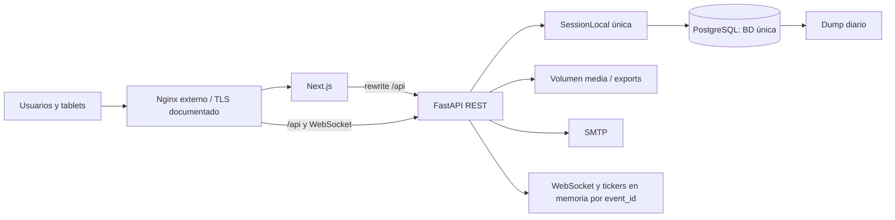
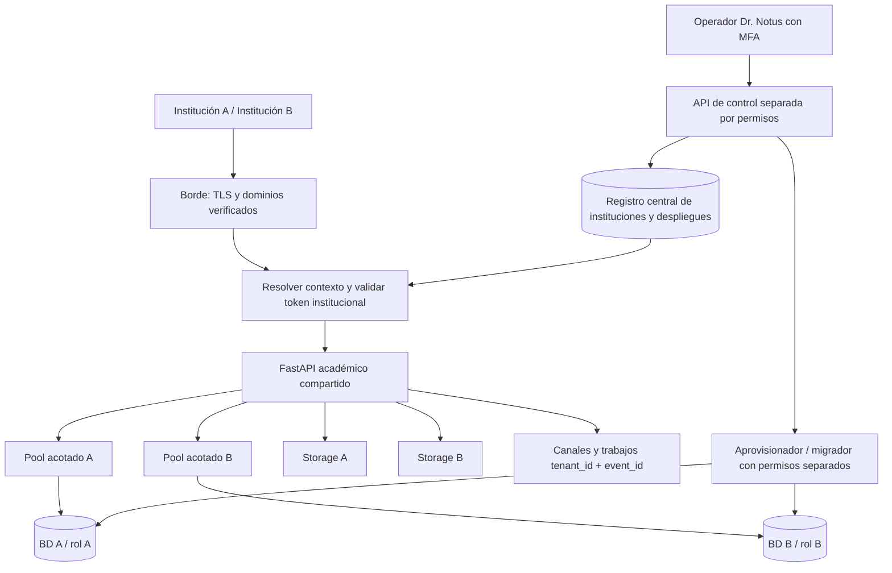

# Auditoría técnica ECOE — Arquitectura SaaS multiinstitucional

Fecha: **9 de octubre de 2026 (America/Santiago)**. Revisión del repositorio: **`f11bb8d`**, con el estado de trabajo observado al comenzar. Alcance: auditoría estática y planificación; no implementación.

## 1. Resumen ejecutivo

**ECOE tiene una base funcional reutilizable, pero todavía no es una aplicación multiinstitucional.** Sus permisos delimitan ECOE dentro de una única base de datos. No existe una entidad institución, resolución institucional de solicitudes, registro de bases ni separación entre administrador central Dr. Notus y administrador de una institución.

La hipótesis **aplicación compartida + PostgreSQL independiente por institución** es la alternativa inicial más conveniente para este repositorio, condicionada a presupuesto operativo y número de instituciones. Permite conservar el esquema académico, la mayoría de consultas por evento, las reglas de evaluación y las interfaces. La adaptación principal corresponde a sesiones SQLAlchemy, autenticación, WebSocket, archivos y operación de la flota de bases. Una base independiente no elimina los riesgos de una sesión dirigida a la base equivocada ni aísla CPU, memoria o fallos de una aplicación compartida.

No se recomienda reescribir el producto, agregar microservicios ni implantar todas las modalidades simultáneamente. Conviene mantener un monolito modular con un plano de control mínimo y un plano académico, preparando los mismos artefactos para despliegues dedicados futuros. Si no se puede financiar la operación de varias bases, instancias dedicadas de la misma versión son un puente posible; no equivalen a haber construido el SaaS compartido.

### Respuestas a las cinco preguntas del propietario

| Pregunta | Respuesta basada en el repositorio |
|---|---|
| ¿Qué puede conservarse? | FastAPI/Next.js, modelo académico por ECOE, estaciones/instrumentos, permisos por evento, pilotaje/ejecución, corrección, deadlines, snapshots de resultados, exportaciones y suites existentes. No hay evidencia para asignar un porcentaje fiable de reutilización. |
| ¿Qué debe modificarse? | Contexto institucional obligatorio; selección segura de sesión/base; tokens y activación vinculados a institución; alcance de administradores; claves de WebSocket/tickers; almacenamiento; configuración visual y académica; migraciones/aprovisionamiento/backup por institución. |
| ¿Qué arquitectura conviene? | Database-per-tenant, inicialmente en un clúster PostgreSQL controlado, con usuarios de BD independientes y capacidad de mover una institución a otro clúster o instalación. |
| ¿Qué riesgos preceden a comercialización? | Check-ins concurrentes, reconsolidación tras cierre, revocación de sockets existentes, recuperación completa BD+archivos, aislamiento institucional todavía ausente y operación dependiente de un servidor documentado como homelab. |
| ¿Qué plan es más seguro? | Resolver integridad actual; definir y probar el contexto institucional; incorporar dos instituciones ficticias; automatizar y ensayar recuperación antes del piloto. Las pruebas negativas y de concurrencia deben comenzar en las primeras fases. |

**Bloqueo comercial:** el software actual no debe presentarse como capaz de aislar dos instituciones reales en una aplicación compartida. Esto es una carencia arquitectónica confirmada, no evidencia de una filtración ya ocurrida.

## 2. Método, evidencia y límites

Se leyeron las guías iniciales `README.md`, `PROJECT_STATUS.md`, `NEXT_STEPS.md`, `datos_proyecto/README.md`, `AGENTS.md` y los documentos de arquitectura P0/matriz/auditoría anterior. Se contrastaron con modelos, configuración, dependencias, rutas, servicios, migraciones, frontend, Docker, CI y scripts de respaldo/restauración.

Las referencias `archivo:Lx–Ly` indican líneas de esta revisión, no de una versión futura. Los enlaces relativos permiten abrir el archivo; los intervalos se expresan en el texto. Clasificación:

- **Confirmado:** conducta o ausencia evidenciada en archivos inspeccionados.
- **Hipótesis:** consecuencia plausible que necesita reproducción o medición; no incidente demostrado.
- **No verificable aquí:** depende de despliegue, datos, contratos o servicios externos no consultados.

No se leyeron `.env`, credenciales locales, bases, dumps, logs operativos ni configuración activa del servidor. No se contactaron los dominios desplegados. Las URLs y notas de operación son evidencia documental, no certificación del entorno actual. No se instalaron dependencias ni se ejecutaron servicios, migraciones, tests, backups, restauraciones o despliegues.

**Por qué no se ejecutaron pruebas:** `backend/tests/conftest.py:61–83` crea/elimina BD SQLite o hace `DROP SCHEMA` y migraciones en PostgreSQL; el lifespan también ejecuta Alembic (`main.py:47–55`). La prohibición expresa de ejecutar migraciones prevalece. Los tests se inspeccionaron; no se afirma que pasen hoy. Las cifras históricas 394 backend/78 frontend de `PROJECT_STATUS.md` no son un conteo verificado de esta revisión. No se realizó auditoría exhaustiva de vulnerabilidades de dependencias ni pentest.

Estado inicial de Git: archivo no rastreado `.claude/settings.local.json`; se preservó sin leerlo ni modificarlo. El único cambio de esta tarea es este informe. No hay commits.

La auditoría de junio contiene brechas hoy corregidas. En particular, no se repite como hallazgo actual que el WebSocket carezca de autenticación, que toda media sea pública, que cada GET de resultados escriba, que no exista CI o que no existan backups. README y notas tienen secciones desactualizadas (por ejemplo, proxy `/backend/api`, conteos y fallback automático); el código es la evidencia principal.

## 3. Estado real e inventario de componentes

### 3.1 Stack y topología

| Componente | Evidencia y versión declarada | Función / dependencia |
|---|---|---|
| Backend | [requirements](../backend/requirements.txt): FastAPI 0.116.1, Uvicorn 0.35.0, SQLAlchemy 2.0.43, psycopg 3.2.9, Alembic 1.16.5, pydantic-settings 2.10.1 | API REST, WebSocket y dominio; sesiones SQLAlchemy síncronas. Pydantic se usa en DTOs; su versión exacta no está fijada directamente en este archivo. |
| Seguridad | python-jose 3.5.0, pwdlib 0.3.0, passlib 1.7.4 transitorio | JWT HS256, Argon2 para hashes nuevos, verificación PBKDF2 legado. |
| Reportes | pandas 2.3.2, openpyxl 3.1.5, reportlab 4.4.3, numpy >=1.26 | Excel, PDF y psicometría; trabajo en el proceso de aplicación. |
| Frontend | [package.json](../frontend/package.json): Next.js 16.1.6, React 19.2.3, TypeScript ^5, Tailwind ^4 | App Router, componentes y cliente API. Rangos no equivalen a versiones instaladas. |
| Runtime | [Dockerfiles](../backend/Dockerfile), [frontend](../frontend/Dockerfile): Python 3.12, Node 22 | Contenedores no-root; backend con un proceso Uvicorn según CMD. |
| Persistencia | [Compose](../docker-compose.yml): PostgreSQL 16-alpine | Una BD académica configurada por `DATABASE_URL`; volumen `postgres_data`. |
| Archivos | `STORAGE_PATH`, volumen `backend_storage` | Directorios locales comunes para media/exportaciones. |
| Correo | [mailer.py](../backend/app/services/mailer.py):29–78 | SMTP síncrono, STARTTLS configurable, envío best-effort; URL pública única. |
| Borde | [nginx de referencia](../datos_proyecto/nginx_ecoe_publico.conf):35–50 y documentación de dominios | TLS/proxy externo al Compose; reenvío REST y upgrades WS. Cloudflare/certificados descritos en notas. |
| Backups | `db-backup`, [restore](../scripts/restore_db.sh), [offsite](../scripts/offsite_drive_push.sh) | Dump diario/rotación; restore global; copia cifrada opcional. Activación real no comprobada. |

`frontend/next.config.ts` configura actualmente rewrite de `/api/:path*` hacia una única API interna y headers de seguridad. No se encontró un servidor de caché, Redis, Celery, broker ni scheduler externo en aplicación/Compose. Sí existen tareas asyncio del cronómetro, barrido perezoso al consultar contextos y bucle diario de backup. No hay que confundir estos mecanismos con ausencia total de procesos de fondo.

### 3.2 Organización y módulos

Backend: `api/routes` contiene auth, usuarios/invitaciones, ECOE, estudiantes/staff, estaciones/bancos/pilotaje, evaluador/estudiante, kiosco, corrección, contingencia, operación y analítica. `services` concentra autorización, instrumentos/bancos, resultados, psicometría, borradores, reloj/ciclo/barrido, SMTP y rate limit; `utils` maneja importaciones/helpers y serialización. `schemas/common.py` concentra DTOs; `models/entities.py` concentra entidades. El dominio depende de una `Session` proporcionada por el llamador en buena parte de los servicios: es un punto favorable para reutilización.

Frontend: `src/app` contiene pantallas de gestión y examen; `components`, `hooks` y `lib` contienen shell, formularios, cliente API, autenticación, permisos y WS. `ECOEProvider` mantiene evento activo y roles efectivos; no contiene institución activa (`frontend/src/lib/auth.tsx:9–60`). Las capacidades se resuelven por evento y el backend conserva la autoridad.

### 3.3 Configuración, CI y pruebas

`config.py:6–59` ofrece configuración única cacheada por proceso: ambiente, DB, secreto JWT, storage, CORS, SMTP y URL pública. `main.py:25–67` bloquea clave vacía en producción, SameSite inseguro y wildcard CORS; aplica migraciones y sólo permite fallback explícito fuera de producción. Seeds demo se ejecutan si el flag está activo y no es producción. El ambiente predeterminado es development y el seed predeterminado está activo: producción necesita configuración deliberada, no inferida por Docker.

[CI](../.github/workflows/ci.yml):9–63 ejecuta pytest con PostgreSQL efímero y migraciones, y frontend test/lint/build. No hay despliegue automático en ese workflow. Existen Vitest, Playwright, `docker-compose.e2e.yml` y `scripts/run_e2e.sh`, pero ese CI no ejecuta el flujo E2E. La cobertura de autorización negativa, revocación, WS, kiosco, modos, deadlines y resultados tiene archivos específicos bajo `backend/tests`. No se encontró una suite de dos instituciones, ni un benchmark de carga institucional.

La cadena Alembic inspeccionada tiene baseline `c7d8e9f00123`, continúa por autenticación, invitaciones, kiosco, corrección, modos, borradores/bancos y roles múltiples, y termina en `q7r8s9t0u1v2` (ciclo automático). El baseline crea tablas; no es la migración vacía descrita en junio. Reproducibilidad PostgreSQL está prevista en CI, pero no se revalidó aquí. SQLite en tests usa `create_all`; no demuestra equivalencia de constraints, locks ni migraciones PostgreSQL.

## 4. Modelo de datos y preparación institucional

Todas las referencias de entidades corresponden a [entities.py](../backend/app/models/entities.py).

| Grupo | Entidades y relaciones principales | Suposición actual |
|---|---|---|
| Identidad | `Role`, `User`, `UserInvitation`, `AuthRateLimit` (31–86) | Email único en toda la BD; roles y tokens de una sola instalación. |
| Permisos | `ECOEPermission` (89–99) | Usuario/rol concedido por evento. |
| Examen | `ECOEEvent`, `Circuit`, `StudentGroup` (102–170) | Escuela/curso son texto, no institución/carrera/sede normalizadas. |
| Participantes | `Student`, `StaffAssignment` (173–211) | Estudiantes por evento; staff/docentes/evaluadores/correctores por rol y correo, no tablas separadas de personas docentes. |
| Contenido | `StationTemplate`, `AssessmentTool`, `AssessmentItem`, `SimulatedPatient`, `StationBank` | Banco común de la instalación, con ownership de origen y soft-delete en varios recursos. No entidad de organización. |
| Estaciones/media | `Station`, `StationResource`, `MediaAsset` (309–424) | Estación por ECOE; asset vinculado a estación y ruta física absoluta. |
| Ensayo/operación | `PilotRun`, `PilotRecord`, `LiveSession`, `StationKioskSession`, `StationCheckIn` (426–544) | Una LiveSession por ECOE; separación pilotaje/ejecución mediante `mode`. |
| Evidencia | `StationResponseDraft`, `EvaluatorRecord`, `StudentResponse` (547–640) | Borradores por check-in; respuestas/evaluaciones únicas por evento/estación/estudiante/modo. |
| Resultados/incidencias | `StationResult`, `ECOEResult`, `Incident`, `ContingencyExport`, `AuditLog` (643–717) | Snapshots por evento; auditoría interna a la BD, sin plano central. |

**No existe una entidad institución/organización ni un registro de conexiones institucionales en los modelos inspeccionados.** `school_name` no cumple esa función. El correo relaciona identidades y muchas asignaciones; el mismo correo en dos instituciones no debe producir un permiso transversal.

### Viabilidad de database-per-tenant

Es favorable porque casi todo el esquema puede residir íntegro dentro de cada BD: usuarios, roles, bancos, eventos, participantes y resultados conservan sus claves y relaciones. No es necesario introducir `tenant_id` en cada tabla académica para esta modalidad. Sí es obligatorio incorporarlo a todo recurso compartido fuera de la BD y al contexto de ejecución.

Las consultas actuales `db.get(..., id)` y `select(...)` pueden conservar su semántica **sólo si `db` está ligada a una institución autenticada e inmutable**. El registro central debe contener metadatos de institución, dominios verificados, estado, modalidad, referencia de secreto de conexión, versión de esquema y política operativa; no contraseñas académicas, puntajes ni participantes. Mantener control y datos en bases distintas, sin FK entre ambas, exige aprovisionamiento idempotente y reconciliación de fallos parciales.

Consultas globales de bancos (`stations.py:105–118`) son correctas para una biblioteca institucional en una BD propia; serían una fuga potencial si se interpretaran eventos como tenants en una BD compartida sin filtros. Cuentas/invitaciones, lookup por email, listados de usuarios, resultados y exports deben usar la sesión institucional. Migraciones, WS y tickers abren sesiones fuera de `get_db` y requieren adaptación explícita.

## 5. Autenticación, autorización y aislamiento de solicitudes

### Controles presentes

- JWT firmado con expiración, issuer, audience, rol y versión (`core/security.py:33–63`). La validación real consulta cuenta activa/estado/versión (`services/dependencies.py:14–41`); no depende únicamente del rol declarado por el token.
- Cookie HttpOnly; Secure se decide por protocolo reenviado; SameSite configurable (`routes/auth.py:17–37`). Bearer también aceptado.
- Rol global `admin_global` separado de roles efectivos de evento; `require_global_roles` evita conceder gestión global sólo por asignación (`dependencies.py:44–102`). `ensure_event_access` comprueba existencia y permisos del ECOE (`authorization.py:54–124`).
- Invitaciones de un uso con hash, expiración y activación; kiosco con hash, expiración y revocación (`services/invitations.py`, `services/kiosk.py:25–84`).
- WS valida Origin cuando existe, autentica usuario o token de kiosco y autoriza evento; entrada WS no controla el reloj (`operational.py:81–150`).
- Media resuelve asset→estación→evento→audiencia/check-in (`services/media.py:86–170`); exports validan estación del evento (`operational.py:508–520`). Hay tests negativos por evento y recurso.

### Separación de autoridades futura

`admin_global` **hoy significa administrador de toda la institución implícita**, no operador central SaaS. Tiene bypass institucional sobre eventos (`authorization.py:62–67,127–134`). Se puede conservar dentro de cada BD, aclarando el nombre visible/semántica como administrador institucional. Dr. Notus necesita identidad, autenticación y permisos separados en el plano central; no debe obtener automáticamente ese rol en todas las bases.

Soporte excepcional: concesión explícita para institución y finalidad, duración corta, aprobación institucional cuando corresponda, MFA, sesión distinguible, auditoría central y local y revocación. Separar gestión de infraestructura de lectura académica. No existe evidencia de este flujo hoy.

### Resolución segura propuesta (todavía no implementada)

1. El borde acepta sólo hosts registrados y verificados. Normaliza dominio/puerto y descarta encabezados institucionales suministrados por el navegador. `Host` es un selector, nunca una prueba de pertenencia.
2. El backend consulta una allowlist de dominios en el registro central, obtiene ID opaco institucional y comprueba estado operativo. Host desconocido, suspendido o ambiguo: denegar; sin fallback a la BD demo.
3. Antes del login, el dominio resuelve la BD para buscar la cuenta; no se recorren bases por email. El token emitido contiene institución y un identificador estable de usuario local, además de issuer/audience/exp/ver. Validación criptográfica precede a confiar en sus claims.
4. Cada solicitud exige igualdad entre institución del dominio y claim firmado, y valida cuenta/versión en esa BD. Cookies host-only y Secure; cambiar de institución requiere autenticar/emitir sesión válida allí. Correo compartido no fusiona cuentas automáticamente.
5. `TenantContext` inmutable se entrega a dependencias REST, handshake WS, kiosco, jobs/tickers y storage. ID enviado en payload/header sólo sirve de contraste, no concede acceso ni suministra DSN.
6. `get_db` usa un registro acotado de engines/pools por institución. Sesión nueva por solicitud, cerrada al finalizar; nunca cambiar globalmente `settings.database_url`, engine, `search_path` ni SessionLocal para atender una petición.
7. Cada sesión de BD queda vinculada al contexto; verificaciones por evento/recurso siguen siendo obligatorias. Credencial de runtime institucional sin DDL, sin superusuario y sin permiso de conexión a otras BD; migrador/provisionador separado.
8. Tareas en fondo capturan sólo identificadores/contexto validado y abren su propia sesión; no heredan una sesión HTTP cerrada. WS usa claves `(tenant_id,event_id)` y revalida permisos/expiración o cierra ante revocación.

En un portal común sin subdominios, la selección debe comprobarse contra membresías autenticadas en el plano de identidad y emitir un token contextual; una selección del cliente por sí sola no basta. Para el inicio se recomienda un origen/subdominio por institución, con allowlist en el servidor.

### SSO futuro

No se encontró implementación OIDC/SAML. OIDC es una primera integración razonable si las universidades lo soportan; SAML dependerá de sus IdP. Mantener un adaptador que mapee `(institución, issuer, subject)` a usuario local; no vincular cuentas sólo por email ni convertir grupos del IdP directamente en administrador. Exigir configuración verificada del IdP, state/nonce, callback institucional autorizado, validación criptográfica y provisioning/revocación definidos. La disponibilidad de protocolos de clientes está pendiente de investigación.

## 6. Hallazgos y brechas priorizadas P0–P3

Complejidad baja/media/alta expresa alcance relativo, no una estimación en días. P0 actuales afectan integridad/seguridad existente; P0 de transición bloquean el SaaS compartido y no implican explotación actual.

### H01 — P0 de transición: no hay frontera institucional

**Confirmado. Evidencia:** `db/session.py:8–20` usa un engine/SessionLocal único; `entities.py:39–140` no incorpora organización; `security.py:38–47` no vincula JWT a institución; `dependencies.py:23` busca por email.

**Impacto/riesgo:** usar eventos como instituciones o dirigir un token a otra base con el mismo email/versión puede conceder capacidades incorrectas. No se ha demostrado un acceso entre tenants: hoy no existen tenants configurados en código.

**Recomendación:** registro central, contexto obligatorio, igualdad dominio/token/institución y sesiones independientes; probar colisiones de IDs/emails. **Complejidad: alta. Dependencias:** decisión de identidad/dominios y secreto de conexiones (fase 1), implementación fase 2.

### H02 — P0 de transición: WS/tickers se identifican sólo por evento

**Confirmado. Evidencia:** `services/websocket.py:29–55,79–87` usa diccionarios por entero y abre SessionLocal global; `routes/operational.py:103–142` también abre sesión directa.

**Impacto/riesgo:** dos bases con ECOE id=1 compartirían canal/ticker si se adapta sólo REST; emisión cruzada de estado y ejecución sobre la BD incorrecta. No es un defecto demostrado entre los eventos de la BD única actual.

**Recomendación:** claves institucionales compuestas, sesiones contextualizadas y pruebas WS A/B con mismos IDs. Para más de un worker, broker con namespace institucional y coordinación; no basta cambiar la clave del diccionario. **Complejidad: alta. Dependencias:** H01; escala horizontal exige H11.

### H03 — P0 actual: check-in activo sin exclusión concurrente

**Confirmado en código; hipótesis de carrera no reproducida. Evidencia:** `routes/evaluator.py:190–301` consulta ingresos confirmados, los cierra e inserta otro sin bloqueo explícito de estación; `entities.py:523–544` sólo tiene índices, sin unicidad parcial de ingreso activo.

**Impacto/riesgo:** dos confirmaciones simultáneas pueden dejar más de un check-in confirmado, mostrar identidades distintas o cerrar el ingreso usado por otro cliente. Afecta tablet/evaluador y amplifica riesgo de atribuir respuestas al estudiante equivocado.

**Recomendación:** serializar confirmación por estación y definir invariantes de ingreso activo por estación/estudiante/modo; respaldarlas en PostgreSQL cuando corresponda. Semántica idempotente para reintentos. **Complejidad: media. Dependencias:** reglas de rotación y concurrencia PostgreSQL; fase 0. Prueba necesaria: dos transacciones reales simultáneas, no sólo TestClient secuencial.

### H04 — P0 actual: congelamiento eludible por consolidación explícita

**Confirmado. Evidencia:** `operational.py:485–494` llama `persist_results` tras autorizar, sin gate de estado; `results.py:342–387` recalcula y borra/reinserta snapshots sin rechazar cerrado/archivado. GET sí lee snapshot (`results.py:306–339`).

**Impacto/riesgo:** un usuario con permisos puede reemplazar el snapshot después del cierre. Si la fuente no cambió, los valores podrían coincidir, pero se reemplaza evidencia/fecha/IDs; si cambió, puede variar la nota. No se observó alteración de notas reales.

**Recomendación:** impedir reconsolidación ordinaria después de cierre; excepcional corrección con motivo, autorización y nueva versión, preservando anterior. Tratar ausencia de snapshot cerrado como inconsistencia explícita, no asegurar que está congelado. **Complejidad: media. Dependencias:** política de rectificación y cierre; fase 0. Test negativo de POST sobre cerrado/archivado, además de GET sin mutación.

### H05 — P1: reintentos/concurrencia de envíos y borradores incompletamente resueltos

**Confirmado en flujos; hipótesis de resultados bajo carga. Evidencia:** `student_access.py:163–194` hace lectura y posterior insert sin capturar IntegrityError; `services/drafts.py:15–34` hace select/insert o actualización sin versión. Unicidad de respuestas en `entities.py:570–613` evita duplicados definitivos. Barrido tiene savepoint/captura (`live_sweep.py:153–162`), pero la limpieza `expunge` tras rollback debe comprobarse: la instancia podría ya no pertenecer a la sesión.

**Impacto/riesgo:** reintento tras respuesta HTTP perdida puede parecer fracaso aunque se guardó; choque insert/insert puede retornar 500; borradores tardíos pueden pisar más recientes. La restricción impide dos filas definitivas, pero no garantiza una respuesta HTTP idempotente ni orden de borradores.

**Recomendación:** confirmación de resultado previo, clave de idempotencia/contexto, versión monotónica de draft y manejo uniforme de conflictos. Probar submit/manual vs sweep, draft vs submit, y desconexión después del commit. **Complejidad: media. Dependencias:** H03, contratos de entrega; investigar en fase 0 y resolver antes del segundo cliente. Elevar a P0 cualquier pérdida/atribución incorrecta reproducida.

### H06 — P1: separación de autoridad central y administración institucional ausente

**Confirmado. Evidencia:** bypass `admin_global` en `authorization.py:62–67,127–134`; `dependencies.py:88–102`; modelos de identidad únicos.

**Impacto/riesgo:** reutilizar admin_global como operador SaaS normaliza acceso central irrestricto a información académica; no hay soporte excepcional trazable.

**Recomendación:** permisos del plano central separados de los institucionales, MFA para operadores y concesiones temporales de soporte. **Complejidad: alta. Dependencias:** H01, política de soporte y privacidad; fases 1–2.

### H07 — P1: almacenamiento y nombres no institucionales

**Confirmado. Evidencia:** upload en `operational.py:354–381` escribe en storage/media común; `MediaAsset.file_path` es absoluto (`entities.py:309–321`); `results.py:1046–1057` usa exports/{tipo}-{event_id}.bin. No se encontró llamada operativa a este último helper salvo reexportación en `services/ecoe.py`: la colisión de exports es riesgo de código disponible, no endpoint activo comprobado. Excel/PDF actuales se retornan en memoria (`operational.py:497–525`).

**Impacto/riesgo:** backups/deletes/movimientos no separables por institución; rutas de distintas BD no aseguran aislamiento físico. Un helper con IDs locales puede sobrescribir export de otro tenant.

**Recomendación:** namespace opaco por institución en filesystem/bucket, keys relativas, versiones únicas de export, autorización previa a lectura y límites por tenant; verificar contención de rutas. Volumen compartido con directorios aislados puede servir al inicio; bucket/object storage facilita réplicas. **Complejidad: media. Dependencias:** H01, ubicación/residencia de datos; fase 2.

### H08 — P1: sockets existentes sobreviven a cambios de permisos

**Confirmado. Evidencia:** `operational.py:103–146` autentica antes de conectar y luego sólo recibe frames; no reconsulta expiración/token_version/estado mientras permanece conectado. Logout sólo elimina cookie (`auth.py:41–44`).

**Impacto/riesgo:** revocación o expiración no corta lectura de un canal ya abierto; token copiado sigue útil tras logout hasta expirar o cambiar su versión. La revocación HTTP por token_version sí está implementada.

**Recomendación:** política de logout/revocación, revalidación temporal de sockets y cierre por suspensión/revocación. **Complejidad: media. Dependencias:** H01/H02, política de sesión. Priorizar corte de socket en fase 0 si se exige revocación inmediata en la versión actual.

### H09 — P1: backups/restores no operan por institución ni prueban recuperación completa

**Confirmado para scripts; ejecución real no verificable. Evidencia:** `docker-compose.yml`, servicio db-backup: dump de una BD diario, retención 14 días; `restore_db.sh:25–36` detiene todo el backend y reemplaza BD fija; `offsite_drive_push.sh:50–67` cifra copia enviada a destinos configurados. `operacion_despliegue.md:167–173` describe backup multimedia manual.

**Impacto/riesgo:** dump de BD no recupera media; un restore global interrumpe a todos; gzip local no es cifrado; no se verificaron cron/offsite/restores efectivos. Frecuencia diaria no garantiza recuperación adecuada durante un examen.

**Recomendación:** catálogo BD+archivos/versiones/checksum por institución, cifrado y custodia de claves, retención y restauración ensayadas, destino independiente; decidir RPO/RTO y necesidad de PITR. Restore primero a destino aislado, sin impedir otros tenants. **Complejidad: alta. Dependencias:** H07 y políticas operativas; validar recuperación actual en fase 0, automatizar fases 3–4.

### H10 — P1: migraciones globales en arranque y URL sobrescrita

**Confirmado. Evidencia:** `main.py:47–55` migra en lifespan; `alembic/env.py:24–26` sustituye URL del Config por settings global; `db/session.py:8–11` crea engine global al importar.

**Impacto/riesgo:** un orquestador que pase una URL por tenant podría terminar migrando la BD predeterminada; arranques simultáneos compiten; un error de esquema puede bloquear toda la aplicación compartida.

**Recomendación:** migrador explícito fuera del serving path, conexión destino validada, privilegio DDL separado, bloqueo por BD, registro de versión y releases expand/contract con canarios. No es obligatorio eliminar Alembic ni reemplazar su historia. **Complejidad: alta. Dependencias:** H01, aprovisionamiento; fases 2–4.

### H11 — P2 (P1 antes de varias réplicas): escalado y recursos compartidos

**Confirmado. Evidencia:** singleton en `websocket.py:119–120`; conexiones/tickers en memoria; `live_cycle.py:140–145` ya usa FOR UPDATE para avance automático. Compose limita memoria y usa almacenamiento local; reportes/SMTP corren en aplicación.

**Impacto/riesgo:** varios procesos no distribuyen broadcast; trabajos redundantes, upload/export costosos o un examen grande perjudican a otros. La persistencia de reloj y lock existente son mitigaciones, no broker.

**Recomendación:** empezar con capacidad medida y límites institucionales; broker/pub-sub y elección/coordinación de ejecutores antes de escalar horizontalmente. Sólo introducir cola durable cuando reportes/correo/carga la justifiquen. Medir conexiones: número de tenants × workers × (pool_size + overflow), más migradores/backup. Límite de engines, eviction segura y presupuesto de conexiones. **Complejidad: alta. Dependencias:** H02, carga objetivo; fases 4–5.

### H12 — P1: configuración institucional y aprovisionamiento inexistentes

**Confirmado. Evidencia:** `config.py:6–48` configuración por proceso; `entities.py:109–114` escuela/curso por evento; `mailer.py:58–59` URL pública global; no modelo institucional.

**Impacto/riesgo:** onboarding exige infraestructura/configuración manual; branding, carreras/sedes, enlaces SMTP, políticas y parámetros no se personalizan coherentemente. Es posible enviar una invitación al origen equivocado tras dividir bases.

**Recomendación:** Institution/Domain/Deployment en plano central, configuración académica/branding local y contrato de configuración; alta idempotente con seed mínimo de roles/admin, nunca demo. Demo Dr. Notus y homelab con BD/storage/cuentas/SMTP separados de producción. **Complejidad: alta. Dependencias:** H01/H06/H10; fases 1–3.

### H13 — P1: auditoría y ciclo de vida de datos insuficientes para operación comercial

**Confirmado parcialmente; políticas externas no verificables. Evidencia:** `AuditLog` (`entities.py:705–717`) tiene actor email/acción/objetivo/payload, sin request_id, IP, institución o controles de inmutabilidad; `student_access.py:184–190` copia payload de respuesta a auditoría; logs de autorización/upload/correo incluyen identidad/nombres (`authorization.py:107–118`, `operational.py:368–370`, `mailer.py:32–51`).

**Impacto/riesgo:** registros duplican datos personales; soporte/exportaciones/lecturas y retención no quedan cubiertos de forma transversal; eliminar participante no elimina necesariamente copia en logs/backups. No se puede declarar cumplimiento.

**Recomendación:** matriz de eventos auditables, IDs de correlación e institución para logs compartidos, minimizar payload y enmascarar URLs/tokens, retención/acceso definidos, registros de soporte protegidos, exportación/rectificación/supresión verificable y tratamiento de backups. **Complejidad: alta. Dependencias:** propietario de datos, contratos y H09; fases 1–4.

### H14 — P2: secretos y confianza en proxies demasiado amplios

**Confirmado como configuración declarada; exploit no verificado. Evidencia:** frontend hereda todo `backend/.env` en Compose; frontend middleware usa HS256 y degrada a cookie presente si falta clave (`middleware.ts:10–25`); backend arranca con `--forwarded-allow-ips '*'`; cookie Secure toma x-forwarded-proto (`auth.py:27–34`). Puertos limitados a loopback mitigan exposición directa.

**Impacto/riesgo:** más procesos reciben secretos de los que necesitan; proxy mal delimitado puede influir IP/seguridad/routing. Middleware no constituye frontera de autorización de API, que sí valida tokens.

**Recomendación:** entorno mínimo por servicio, validación de configuración, allowlist de proxies/redes y hosts, migrador/runtime con secretos distintos; evaluar firma asimétrica para que frontend sólo tenga clave de verificación. Cookies host-only, revisión CSRF para subdominios del mismo sitio y validación Origin en mutaciones sensibles. **Complejidad: media. Dependencias:** topología de borde e identidad; fases 0–2. No se inspeccionaron valores secretos actuales.

### H15 — P1: namespace local de navegador sin institución/usuario

**Confirmado; mezcla condicionada al origen. Evidencia:** `auth.tsx:50–59` usa ecoe-event-id; `student/page.tsx:65,468` usa checkin_id; `kiosk/page.tsx:20,96,196` token fijo/draft por check-in.

**Impacto/riesgo:** un portal de origen compartido, cuentas sucesivas o IDs reutilizados pueden recuperar borradores anteriores. Subdominios distintos separan localStorage por origen, pero no resuelven reutilización de cuentas dentro del mismo origen ni retention local.

**Recomendación:** claves con institución/actor/evento/check-in/modo, expiración y limpieza al cerrar/desvincular; recuperar sólo borrador del contexto actual autenticado. **Complejidad: media. Dependencias:** H01, decisión de orígenes; fase 2.

### H16 — P2: archivos admitidos y consumo de memoria requieren endurecimiento

**Confirmado. Evidencia:** `media.py:26–54` permite SVG/documentos y sólo algunas firmas; `operational.py:358–365` lee archivo completo antes de validar tamaño, con MIME declarado por cliente.

**Impacto/riesgo:** concurrencia de uploads consume memoria; contenido activo/malicioso depende de cómo se entregue/renderice y requiere análisis específico. No se afirma XSS explotable probado.

**Recomendación:** streaming/límite previo en borde y backend, cuotas por institución, tipo detectado y políticas de sanitización/attachment; investigar SVG/Office y escaneo según exposición. **Complejidad: media. Dependencias:** H07, carga y política de contenidos; fases 2–4.

### H17 — P2: garantías operativas y pruebas multiinstitucionales no demostradas

**Confirmado en repositorio; estado CI actual no consultado. Evidencia:** `ci.yml:9–63`, `tests/conftest.py:46–49` desactiva ticker; `/health` en `main.py:82–89` sólo devuelve ok; notas de despliegue externas.

**Impacto/riesgo:** pruebas secuenciales/SQLite no aseguran concurrencia o recuperación; health no informa conectividad/esquema por institución; releases no prueban dos bases. Ticker de producción necesita tests propios pese a su cobertura funcional de servicio.

**Recomendación:** CI PostgreSQL A/B, E2E institucional, pruebas reales ticker/WS y transacciones, health global vs readiness por tenant, métricas/alertas sin datos sensibles, separación staging/homelab y ensayo de release/restore. **Complejidad: media/alta. Dependencias:** H01/H10, objetivos SLO; desde fase 0 y transversal.

### H18 — P3: SSO, portabilidad avanzada y catálogo central

**Ausencia confirmada en código inspeccionado. Impacto:** integración empresarial, traslado y administración de versiones a gran escala requerirán más capacidades.

**Recomendación:** adaptadores OIDC/SAML, export/import de institución con manifiesto BD+assets, despliegue dedicado/on-premise con imagen/versiones idénticas, catálogo académico central sólo si el producto lo requiere y con importación explícita/versionada. No compartir objetos académicos con FK entre tenants. **Complejidad: alta. Dependencias:** contrato de aislamiento, fases 1–5 y demanda comercial.

### Resumen de preparación

| Área | Estado actual | Puerta mínima para segunda institución |
|---|---|---|
| Dominio ECOE | Reutilizable | H03–H05 investigados/resueltos, regresión negativa. |
| BD y permisos | Por evento dentro de una BD | H01/H06/H10, credenciales separadas y A/B. |
| WS y fondos | Autenticado; namespace de evento local | H02/H08; H11 si hay varios workers. |
| Archivos/cliente | ACL por evento; storage/keys comunes | H07/H15/H16 según exposición. |
| Onboarding/config | Una instalación | H12 y alta/reintento/suspensión seguros. |
| Operación/privacidad | Controles parciales, backups disponibles | H09/H13 y ensayos H17; políticas verificadas. |

## 7. Funcionamiento operativo e impacto de la transición

| Operación | Qué conservar | Qué verificar/adaptar |
|---|---|---|
| Crear/configurar ECOE | Máquina de estados, validación, duplicación | Admin local del tenant; IDs sólo interpretados en su BD; congelar configuración relevante en publicación. |
| Asignar equipo/estudiantes | Invitaciones, roles por evento, importaciones | Email local, sin lookup transversal; enlaces del dominio correcto; no propagación automática de roles. |
| ECOE simultáneos | LiveSession por evento, deadlines persistidos | Namespace compuesto, cuotas, locks; concurrencia dentro del mismo tenant y A/B. Una sesión por ECOE limita sesiones independientes de un mismo evento. |
| Puntajes/corrección | Máximo autoritativo, gates, modo, unique constraints | Reintentos idempotentes, cierre vs submit/corrección, H03–H05; no permitir reemplazo silencioso. |
| Conexión inestable | LocalStorage, draft server-side, latido y sweep | Orden/versionado de drafts, ACK tras commit, consulta de recepción y recuperación tras caída. No hay offline durable garantizado. |
| Interrupción/reinicio | Reloj por timestamps; lazy sweep y FOR UPDATE | Recuperar ticks, permisos, estado y borradores sin canal cruzado; probar reinicio en transición y sin clientes conectados. |
| Resultados/psicometría | Snapshots y Excel multihoja | H04; procedencia del informe (institución/evento/versión/fórmula), separar análisis por modo y no mezclar bases. |
| Contingencia/trazabilidad | Endpoints autorizados, gate de etapa y audit | Reconocer entrega anterior, motivo/contexto, permisos locales y auditoría de soporte; restauración coherente. |

Los endpoints GET de resultados inspeccionados no persisten resultados. Algunos GET operativos sí provocan avance/barrido perezoso: no deben tratarse como lecturas sin efectos al diseñar caches, réplicas de lectura o monitoreo. Los reportes se calculan en memoria; no se encontró cola de reportes ni caché analítica compartida actual. Cuando se agreguen, sus claves/jobs deben incluir tenant y autorización vigente.

## 8. Comparación de alternativas

Comparación relativa para este repositorio, sin cotizaciones ni cifras de capacidad. Aislamiento depende de implementación y privilegios, no sólo del nombre de la estrategia.

| Modalidad | Aislamiento real | Adaptación | Coste/escala | Releases y mantenimiento | Backup/restore y traslado |
|---|---|---|---|---|---|
| BD compartida + tenant_id | Lógico; una consulta sin filtro puede mezclar datos. RLS y FK compuestas reducen riesgo si se diseñan correctamente. | Alta: agregar tenant a identidades/bancos y revisar todas las consultas, joins, constraints, exports y jobs. | Menor coste inicial; pools simples, ruido compartido y tablas mayores. | Migración única y release central simple; alta disciplina permanente de tenancy. | Dump global fácil; restore/export selectivo difícil y debe preservar relaciones. Traslado requiere extracción completa y remapeos. |
| Schema por institución | Namespace dentro de la misma BD; permisos/search_path son críticos. | Media/alta: routing de schema, migraciones, pools y reset de conexión. | Coste intermedio; muchos schemas/objetos y conexiones; CPU/WAL compartidos. | Un esquema por migrar; riesgo de search_path residual; centralización de app. | Backup de schema más delimitado; dependencias comunes complican traslado y restore. |
| BD por institución | Separación de conexiones/datos y credenciales; app y clúster aún compartidos. | Alta en infraestructura/contexto, menor en consultas/esquema académico. | Coste intermedio; conexiones, migraciones y monitoreo crecen con tenants. | Una app central; rollout de esquemas por BD, compatibilidad temporal obligatoria. | Dump lógico institucional y movimiento más directos; media se traslada aparte. PITR físico suele ser de clúster y requiere estrategia de restore selectivo. |
| Instancia dedicada | Mayor aislamiento de proceso; máximo sólo si también se separan infraestructura/credenciales/red. | Baja/media como puente con imagen idéntica y configuración; automatización posterior. | Más coste y administración por cliente; capacidad individual independiente. | Actualizaciones de flota, deriva si se personaliza código/config manualmente. | Restore y fallos más delimitados; exportar BD/assets facilita traslado. |
| Híbrida SaaS + dedicado | Según modalidad; no existe aislamiento automático por ser híbrida. | Alta si se implementa todo al inicio; moderada si se prepara portabilidad desde una modalidad. | Coste variable, mayor complejidad de soporte/versiones. | Artefacto común, versiones soportadas y configuración declarativa; on-premise puede retrasar upgrades. | Contrato de export/import uniforme facilita movilidad; ventanas de corte y reconciliación siguen necesarias. |

PostgreSQL documenta que una conexión opera sobre una BD y que los schemas son accesibles según privilegios, sin separación rígida equivalente: [Schemas](https://www.postgresql.org/docs/18/ddl-schemas.html). Para la versión 16 declarada, `CONNECT` puede estar concedido a PUBLIC por defecto: revocarlo/configurar roles es parte del diseño, no asumir aislamiento sólo al crear bases: [Privileges PostgreSQL 16](https://www.postgresql.org/docs/16/ddl-priv.html).

## 9. Arquitectura recomendada y justificación

**Inicio: monolito modular compartido, plano de control pequeño y base PostgreSQL por institución; almacenamiento institucional separado.** Un clúster puede alojar inicialmente esas bases, con permisos de conexión explícitos y usuario de runtime por BD. No prometer aislamiento de infraestructura donde sólo existe separación de datos. La demo es otra institución ficticia aislada, preferentemente en entorno distinto a producción; el homelab no aloja datos comerciales reales por defecto.

### Contratos de implementación necesarios

- **Plano de control:** Institution (ID estable, nombre/estado), Domain (verificado/canónico), Deployment (modalidad/ubicación/referencia de secreto/versiones), operadores y concesiones de soporte. Auditoría de control separada. Campos propuestos, no entidades existentes.
- **Plano académico:** esquema actual más configuración institucional/carreras/sedes según necesidad confirmada. Usuarios locales para primera versión; cuentas de la misma persona entre instituciones son independientes. Evitar duplicar un directorio académico central sin una razón de producto.
- **Pools:** creación perezosa, límites, TTL/evicción sin cerrar sesiones en uso, rotación de credenciales, observabilidad por BD. Nunca un engine nuevo por petición ni acumulación ilimitada de pools.
- **Fallos:** BD de A caída no debe redirigir a B ni bloquear readiness de B; registro central indisponible requiere política explícita de caché de rutas validadas, sin inventar instituciones ni permitir nuevas altas. Cachear metadatos no equivale a cachear permisos indefinidamente.
- **Versiones:** misma imagen, esquema homogéneo cuando sea posible y ventana de compatibilidad documentada. Migrar canario, comprobar y continuar; detener sólo tenant afectado cuando corresponda. Mantener versiones mínimas/máximas compatibles en el registro.
- **Recursos:** cuotas de media/reportes, límites de conexiones/rate limit por institución y protección global de borde. El rate limit actual persiste buckets en BD (`rate_limit.py:22–28,45–87`); al separar bases, su bucket “global” se vuelve local a esa BD. Hace falta decidir límite de plataforma adicional.
- **Dedicado/on-premise:** mismo código/imágenes y esquema; instalación de una institución con registro mínimo/contexto fijo verificado. Actualizaciones soportadas y migrador local; operación no debe necesitar conexión permanente a Dr. Notus para evaluar si se ofrece autonomía on-premise.

### Traslado entre modalidades

Plan futuro: bloquear escrituras del tenant durante ventana acordada, drenar/cerrar WS y trabajos, exportar BD+assets+manifiesto/versiones, restaurar y verificar conteos/checksums/resultados, rotar credenciales, cambiar ruta en registro/dominio e invalidar sesiones necesarias. Ensayar reversión sin aceptar escrituras simultáneas en origen y destino. No fusionar IDs de diferentes instituciones. Durante esta auditoría no se exportó ni trasladó nada.

## 10. Seguridad y preparación para protección de datos en Chile

| Control | Evidencia presente | Ausente o no verificable |
|---|---|---|
| IDOR/BOLA | Permisos por ECOE, matching estación/evento, audiencias, tests negativos | Tenancy completa inexistente; no se verificó cada endpoint con pentest. |
| Credenciales | Hash Argon2, tokens invitación/kiosco hasheados, validación JWT/versión | Gestión central de secretos, rotación real y MFA no demostrados. No se leyeron secretos. |
| Tránsito | TLS documentado en nginx/Cloudflare; SMTP STARTTLS configurable | Certificados/proxy activos y TLS hacia BD no verificados. Compose usa red interna; no declarar cifrado end-to-end. |
| Reposo | Script offsite AES256 disponible | Cifrado de volúmenes/BD/dumps locales, custodia y ejecución real no verificados. |
| Auditoría | AuditLog en acciones académicas sensibles | Cobertura de accesos/export/soporte, inmutabilidad, minimización y retención completas ausentes/no verificadas. |
| Recuperación | Dump diario y script restore | RPO/RTO, ensayo integral BD/media, PITR y restore por tenant no demostrados. |
| Supresión/rectificación | Soft-delete en bancos y suspensión de cuentas | Flujo integral de datos personales/logs/backups y preservación académica no definido en código inspeccionado. |
| Acceso de soporte | Administrador institucional | Concesiones temporales Dr. Notus y registro separado inexistentes. |

Al 9 de octubre de 2026, la revisión debe considerar el marco de la Ley 19.628 y la transición normativa: la BCN indica entrada en vigencia de la Ley 21.719 el **1 de diciembre de 2026**. Fuentes: [Ley 19.628](https://www.bcn.cl/leychile/Navegar?dt=open&idLey=19628) y [Ley 21.719](https://www.bcn.cl/leychile/Navegar/imprimir?idNorma=1209272). Este informe no determina bases legales ni certifica cumplimiento.

Preparación técnica recomendada: inventario de datos/finalidades, responsables de decisiones y accesos, política de retención configurable, mecanismos de atención de derechos, trazabilidad de cesiones/soporte/exportaciones, protección de respaldos y procedimientos de incidentes. Definir con asesoría jurídica las responsabilidades de institución/Dr. Notus, residencia/transferencias, contratos y conservación de evidencia de notas. No asumir que toda nota académica es dato clínico de paciente: verificar qué información real se cargará en escenarios, multimedia y observaciones. No usar datos reales en demo o pruebas.

## 11. Hoja de ruta propuesta — no ejecutada

El orden solicitado es viable con dos ajustes: **backup/recuperación y pruebas negativas empiezan en fase 0**, y la primera prueba A/B forma parte de fase 2. Fase 5 es validación de conjunto/carga, no el primer momento para descubrir una fuga. Cada fase requiere criterio de salida antes de incorporar datos reales.

### Fase 0 — Integridad y operación de la versión actual

**Objetivo:** resolver riesgos que existen incluso con una institución. **Cambios futuros:** H03/H04, investigación concurrente H05, revisión de revocación H08/proxies H14; comprobar respaldo completo y restauración aislada; depurar documentación operativa contradictoria.

**Dependencias:** políticas de cierre/rectificación/confirmación, entorno de prueba PostgreSQL exclusivamente ficticio. **Riesgos:** cambiar reglas operativas del examen o interpretar retries como reemplazos.

**Aceptación:** un ingreso activo conforme a invariantes; consolidación cerrada rechazada sin alterar snapshots; entregas simultáneas no pierden evidencia; recuperación de BD+media demostrada y sesión revocada según política definida.

**Pruebas recomendadas:** transacciones concurrentes de check-in; dos submits y pérdida de ACK; submit vs sweep/cierre; POST consolidar cerrado/archivado; suspensión/expiración con WS conectado; restauración de copia ficticia. No ejecutar en servidor real.

### Fase 1 — Institución y plano de control mínimo

**Objetivo:** fijar contrato de aislamiento/autoridades. **Cambios futuros:** Institution/Domain/Deployment, estados y referencias a secretos; identidad de operador central separada; diseño de TenantContext y configuración institucional; decisiones de datos/soporte/dominios.

**Dependencias:** fase 0 y decisiones del propietario. **Riesgos:** centralizar datos académicos innecesarios o crear un superadmin universal.

**Aceptación:** matriz central/institucional/evento aprobada, dominio verificado, institución suspendida denegada, no exposición de DSN/secretos, esquema de control sin resultados/participantes.

**Pruebas recomendadas:** host desconocido/duplicado, header falsificado, operador sin concesión intentando API académica, estado suspendido, fallo del registro y auditoría de cambio de ruta.

### Fase 2 — Aislamiento BD/auth/storage y prueba A/B temprana

**Objetivo:** contexto institucional obligatorio en todos los caminos. **Cambios futuros:** H01/H02/H06–H08/H10/H15; pools limitados, JWT contextual, login/activación/kiosco locales, prefijos storage, sesión contextual de ticks y migrador explícito. H16 según política de uploads.

**Dependencias:** fase 1, secretos/roles de BD separados y decisión de orígenes. **Riesgos:** sesiones globales ocultas, canales por ID local, URL Alembic sobrescrita, cookies/drafts recuperados en otra institución.

**Aceptación:** A y B con mismos IDs y correos funcionan sin cruzar cuentas, permisos, archivos, reloj o reportes; credencial A no conecta a B; ningún fallback ante error; demo/homelab independientes.

**Pruebas recomendadas:** token A en dominio B; admin A frente a users/results/media B; invitación/kiosco A usados en B; dos WS event_id=1; ticker accede sólo a su BD; recorrido de todos los routers y fondos; borradores en origen compartido si se admite. Tests PostgreSQL negativos obligatorios.

### Fase 3 — Aprovisionamiento y autonomía institucional

**Objetivo:** alta de institución sin editar código. **Cambios futuros:** job idempotente crea BD/rol/storage, migra, inserta roles mínimos y emite invitación admin; configura dominio/branding/carreras/sedes/parámetros; suspensión/reactivación; reconciliación de fallos parciales.

**Dependencias:** fase 2, contrato de configuración y H12. **Riesgos:** institución marcada activa antes de completar assets/schema; seed demo accidental; enlaces al dominio incorrecto.

**Aceptación:** alta repetida no duplica recursos; fallos no exponen tenant incompleto; suspensión impide sesiones/trabajos; administrador local configura su institución y no la ajena; cero datos ficticios preinsertados en tenant real.

**Pruebas recomendadas:** interrupción después de cada paso, retry, rotación de secreto, alta/suspensión en paralelo, invitación de un uso, branding/config A/B e imposibilidad de editar registro central con rol institucional.

### Fase 4 — Releases, recuperación y observabilidad

**Objetivo:** operar sin depender de intervención manual del homelab. **Cambios futuros:** H09–H11/H13/H17; imágenes/release central, migración canaria y compatibilidad de esquemas, backups cifrados con catálogo, monitoreo/alertas y runbooks. Broker sólo si se usan varios workers; cola si carga lo requiere.

**Dependencias:** fases 2–3, RPO/RTO/SLO y presupuesto definidos. **Riesgos:** saturación de pools, una migración detenida paraliza toda la plataforma, claves de backup irrecuperables o restauración sin media.

**Aceptación:** una BD caída/migración fallida no afecta lectura/escritura de B; restore institucional completo dentro de objetivos acordados; alertas por falta de backups/error/latencia; artefacto/versiones trazables; sin secretos/tokens en logs.

**Pruebas recomendadas:** canario fallido, restart/rollback compatible, pérdida de un nodo, restaurar A mientras B evalúa, reconciliar archivos/checksums, rotar clave y recuperar respaldo antiguo; conexiones máximas y broadcast entre workers si aplica.

### Fase 5 — Dos instituciones ficticias y carga operativa completa

**Objetivo:** demostrar aislamiento e integridad bajo concurrencia y fallos. **Cambios futuros:** ampliar CI/E2E y pruebas de carga con datos ficticios; ticker real habilitado en entorno aislado; métricas y evidencia de aceptación.

**Dependencias:** fases anteriores y tamaño objetivo de examen. **Riesgos:** simular sólo navegación y omitir picos de autosave/fin de fase/exportación.

**Aceptación:** cero acceso/emisión cruzada, cero duplicación/pérdida de entregas confirmadas, snapshots reproducibles; latencia y recuperación dentro de umbrales aprobados, sin atribuir al aislamiento garantías de capacidad no medidas.

**Pruebas recomendadas:** A/B con IDs/emails coincidentes, ECOE simultáneos, kioscos/evaluadores, pico de envíos al buzzer, drafts desordenados, pausa/reconexión/reinicio, corrección/contingencia/cierre/export, restore y falla de una BD; medir p95/p99, errores, CPU/memoria, pools, tick lag y duración de reportes. Número de clientes/picos debe corresponder a demanda acordada, no una cifra inventada.

### Fase 6 — Piloto real y preparación comercial

**Objetivo:** validar operación institucional y soporte con compromisos explícitos. **Cambios futuros:** onboarding controlado, runbooks del examen, contratos/políticas revisados, soporte temporal, simulacro previo y criterios de salida comercial.

**Dependencias:** evidencia fase 5, responsables operativos y revisión jurídica. **Riesgos:** prometer SLA/cumplimiento/capacidad que no se midió; incorporar datos reales antes de validar restore.

**Aceptación:** aprobación del propietario/institución, prueba de red en recinto, recuperación ensayada, responsables y escalamiento de incidencias, límites de servicio y versión soportada; decisiones documentadas de continuidad y borrado.

**Pruebas recomendadas:** ensayo ficticio institucional completo, recuperación y soporte revocable, checklist de día de examen y seguimiento del piloto; habilitación real sólo después de las puertas de seguridad. No ejecutar ninguna fase como consecuencia de este documento.

## 12. Riesgos técnicos y operacionales residuales

- **Aplicación/clúster compartidos:** una vulnerabilidad de proceso, consumo de CPU o incidente del host puede afectar a varias instituciones aunque sus bases sean distintas. Dedicado sólo se ofrece con aislamiento explícitamente contratado.
- **Flota de bases:** crecen conexiones, tiempo de migración, backups y administración de versiones. Sin automatización, database-per-tenant traslada el riesgo al operador.
- **Identidad por correo:** el código actual utiliza email en asignaciones y auditoría; cambiar correo/SSO exige una estrategia de identidad estable y compatibilidad, sin fusionar tenants.
- **Reglas académicas:** fórmulas/estándares diferentes requieren configuración validada y trazable; no introducir parámetros que cambien notas retrospectivamente.
- **Continuidad de examen:** autosave no equivale a offline garantizado; una interrupción larga necesita contingencia y confirmación de recepción. El límite de tiempo y el orden de recuperación deben ensayarse con los usuarios.
- **Portabilidad:** rutas absolutas y dependencia de servicios de control pueden impedir un on-premise autónomo; validar modo de operación desconectado antes de prometerlo.
- **Recuperación/eliminación:** BD, media, auditoría, exports y copias deben tratarse como un conjunto; borrar un registro no elimina automáticamente todas sus reproducciones.
- **Evidencia limitada:** no se midió carga, no se verificó infraestructura activa ni contratos. La recomendación técnica es condicional a esos datos.

## 13. Decisiones pendientes del propietario y preguntas previas

| Decisión | Preguntas que deben resolverse | Condiciona |
|---|---|---|
| Volumen y servicio | ¿Cuántas instituciones, ECOE simultáneos, estaciones, tablets y alumnos al inicio/año 2? ¿SLO y presupuesto operativo? | Pools, clúster, broker y dedicado. |
| Identidades | ¿La misma persona tendrá cuentas independientes o identidad central con membresías? ¿Quién administra altas/bajas? | JWT, SSO, email, consentimiento y soporte. La recomendación inicial es local por institución. |
| Orígenes | ¿Subdominio por institución, dominios propios o portal compartido? ¿Quién verifica propiedad? | Resolver seguro, cookies, CORS, CSRF y localStorage. |
| Datos | ¿Se cargarán RUT, observaciones clínicas reales o pacientes reales en multimedia? ¿Quién determina finalidad/retención y residencia? | Privacidad, acceso, backups y contratos. |
| Evidencia académica | ¿Cuándo se considera nota definitiva? ¿Quién puede rectificar y con qué motivo/versión? ¿Cuánto conservar? | H04, snapshots, auditoría y supresión. |
| Recuperación | ¿Cuántos minutos de respuestas puede perderse como máximo? ¿En cuánto debe volver el examen? | RPO/RTO, frecuencia, PITR y contingencia. |
| Soporte Dr. Notus | ¿Quién aprueba acceso excepcional? ¿Lectura o escritura? ¿Plazo y registro? | Plano central, MFA y concesiones. |
| Autonomía | ¿Qué puede configurar la institución: branding, carreras/sedes, notas, invitaciones, SSO? | Modelo/configuración y onboarding. |
| Despliegues | ¿Se ofrece SaaS únicamente al inicio? ¿Dedicado en infraestructura propia o del cliente? ¿On-premise sin internet? | Roadmap híbrido y versiones soportadas. |
| Operación | ¿Quién responde durante exámenes? ¿Qué infraestructura reemplaza/separa homelab, staging y producción? | Piloto y comercialización. |

### Investigaciones adicionales necesarias

1. Reproducir H03/H05 y carrera de consolidación/cierre sobre PostgreSQL ficticio con transacciones concurrentes; verificar comportamiento de rollback/expunge del sweep.
2. Auditar exhaustivamente permisos de cada ruta, export y recurso global; la inspección actual muestra controles favorables, no prueba de ausencia universal de BOLA.
3. Revalidar migraciones desde vacío y upgrades de versión soportada en laboratorio, sin fallback create_all; medir tiempos/locks con volumen realista ficticio.
4. Revisar configuración efectiva de proxies/TLS/credenciales con acceso operacional específicamente autorizado y sin divulgar secretos; no hacerlo como parte de este informe.
5. Comprobar cron/offsite, retención, cifrado y restore real de copias ficticias, además de inventario de assets; evidencia de scripts no demuestra ejecución.
6. Obtener requisitos IdP, contratos de datos/soporte, residencia y números de carga antes de fijar inversión/SLA.
7. Validar política de contenidos activos, límites de uploads/reportes y cabeceras/cache para respuestas privadas al incorporar dominios institucionales.

## 14. Cierre de la auditoría

La base funcional permite una evolución progresiva sin reemplazar el dominio ECOE. El trabajo esencial es establecer una frontera institucional verificable en cada entrada y recurso, cerrar brechas de integridad actuales y demostrar recuperación/operación antes de abrir una segunda institución real. Database-per-tenant encaja con el esquema existente, con el coste explícito de operar una flota de bases y proteger correctamente la aplicación compartida.

**Esta auditoría termina con este documento. No se implementó la propuesta, no se ejecutaron fases, migraciones, commits ni despliegues.**
